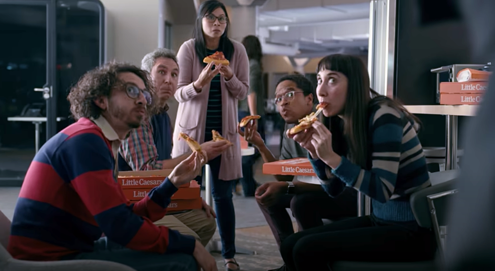
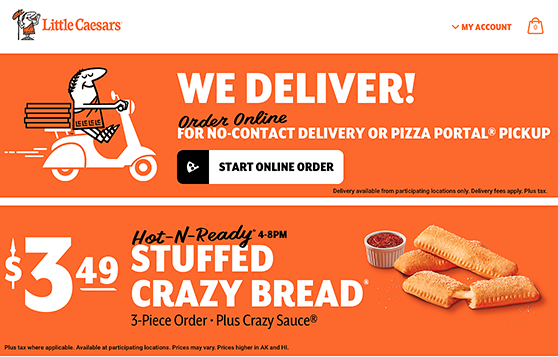

Starting from a single, family-owned restaurant in 1959, Little Caesars has grown into the third-largest pizza chain in the world. Today the company has stores in all 50 U.S. states, plus 26 additional countries and territories. Little Caesars runs more than 20 websites to support all of those stores with marketing content and easy online pizza ordering.

The company's existing site architecture, however, was far from streamlined, and this impeded both performance and development. The Little Caesars technical team decided that the best approach for providing an outstanding customer experience across all those different sites would be a unified ordering platform with scalability built in.

There was also a deadline: It all had to be up and running by February 2, 2020, without fail. The company was planning its [first-ever Super Bowl ad](https://www.youtube.com/watch?v=p5u-vBV8NUU&list=PLNW319kQi_h9ANcXmvhI8u_2mQLUgoZbF&index=4) — starring Rainn Wilson from The Office — for the 2020 game, Super Bowl LIV. The commercial promoted the company’s newly launched nationwide delivery initiative which, according to the commercial, was the best thing since sliced bread.

The Little Caesars team expected a massive surge in orders as soon as the ad hit the airwaves. The new site had to be ready to handle droves of hungry football fans across the entire United States, ordering all at once.

## A new game plan with Gatsby

In choosing a framework for the website relaunch, the Little Caesars team had a clear favorite: Gatsby.

The existing website architecture used a `create-react-app` single-page app for the homepage, plus subsequent content pages completely decoupled from that app. While the Little Caesars team liked developing in React, the overlaid website architecture was difficult for developers to manage and could create a disjointed user experience. The team knew it needed to simplify. “We wanted to present a single, unified experience to our customers,” says Andrew Smith, Application Architect for Little Caesars.

Meanwhile, the need to bolster security led the team to prioritize JAMStack and static pre-rendering over server-based frameworks. “Large companies like ours can be targets for malicious activity,” says Smith. “We knew that a static site would reduce risks by avoiding the vulnerabilities of database-driven approaches.”

Because Gatsby is built on React, the Little Caesars team could transition quickly. “It was a very small learning curve for our developers,” says Smith. “Most were React developers already, so they could dive in and start working with Gatsby pretty seamlessly. And because we use a React design system, Gatsby can natively take advantage of our existing shortcuts. So Gatsby integrated easily with our workflows.”

“The previous version of the website was partially built on Gatsby, so we had an opportunity to prove the technology would work well for us before adopting it more comprehensively,” says Smith. “I didn’t have to do much convincing. Our developers were super happy with how Gatsby works.”

Implementing Gatsby throughout the website also simplified the architecture. “Instead of content pages that were decoupled from the homepage, Gatsby allowed us to create a website that was one unified piece,” says Smith. “It’s easier for developers to manage, and it delivers a more unified, not to mention faster, experience for customers.”

Gatsby also improved site security. “The great part about Gatsby is that there's basically nothing there to attack,” says Smith. “The only thing living out there is static files, so nothing like an admin interface to hack or take advantage of or breach. Security is basically built in.

## Gatsby Themes delivers easy updates

[Gatsby Themes](https://www.gatsbyjs.org/docs/themes/), powerful plugins that abstract configuration content into installable packages, were a key reason why Smith’s team chose Gatsby. Little Caesars uses two core themes across all their sites, one for marketing and one for e-commerce. “The marketing theme handles the banners, the ads, and the website content. That's all in one section,” says Smith. “Then we have the ordering theme, which is the place for us to define routing for the application, with a series of npm packages to pull in data.” What that's allowed us to do is easily install ordering (e-commerce) capability on any Gatsby website that we want: Just pass a set of configurations into the ordering theme and then the site just has all the online ordering capabilities built right in.”

Using themes with packages also dramatically streamlines site updates across the company’s 20+ global websites. “When we launch a new site in a different country, we can do an npm install on the ordering theme. We pop in some configuration and translation files, and we’re mostly ready to go, which is really cool,” says Smith. “Going forward, we can release a new update to the ordering theme and simply bump up the version on each site when we’re ready. That portability of packages is a big benefit.”

<CloudCallout>
  Sites built with Gatsby are fast no matter where they run. But when a Gatsby
  site runs on Gatsby Cloud, it can make the Kessel run in less than 12 parsecs!
</CloudCallout>

## Ready for the Big Game

Corporate website launches are always a big event, but the heavy investment in the Super Bowl ad placed even more pressure on this particular project. Fortunately, the Little Caesars team was able to get the new site up and running fast — just as the play clock was ticking down. The site was fully operational a mere three days before the Super Bowl, and the ad’s premiere.

“The marketing team was super stressed — they definitely needed the new site ready for the big day,” says Smith. “Using Gatsby, we were able to meet that incredibly tight deadline.”

The ad, meanwhile, was a stunning success, reaching up to 102 million viewers tuning in for the 2020 Super Bowl. As word spread about the ad, it became the [top online performer among restaurant ads](http://www.edo.com/insights/superbowl_liv/) that aired during the game. Fans and customers continue to watch the extended version on YouTube, which garnered more than 3.4 million views in just a few months:

https://www.youtube.com/watch?v=vnLBmYCHjZI

## Delivering responsive web performance -- and more pizzas

The new site was able to handle the post-ad traffic without a hiccup. “Traffic spiked immediately after the Super Bowl ad aired, and we saw a high number of simultaneous uses. I remember watching and seeing we had 3,000 simultaneous users, then 10,000, then a few seconds later it was 15,000 -- and we just didn't have to worry,” says Smith. “Because we built with Gatsby, we knew we had the performance to handle the traffic without even thinking about it.”

The infrastructure team was particularly impressed. “By using Gatsby, we were able to accommodate all of that traffic without having to scale the infrastructure at all when migrating from the old site to the new site,” says Smith.

Little Caesars new Gatsby-based architecture turned out to be a gift that keeps on giving. “We had an emergency request from the international business leadership to upgrade our Canada site to the latest e-commerce package -- and they needed it in a week,” Smith says. “Luckily, the Canada website was on Gatsby 2.0 so a quick version bump to support themes and an install of our ordering themes, and Canada had a brand new e-commerce app in less than a week.”

“That definitely contributed to our bottom line in Canada when the pandemic hit,” he continues, but there was another payoff that the team savored even more: “Leadership presented us with an impossible task, and we turned around and said ‘We’re already prepared for that, here you go!’”

Customers now enjoy a single, unified, and responsive web experience that lets them find what they want quickly. But the move to a new website framework behind the scenes was pretty much invisible to customers. “We heard feedback about the site being speedy, but no major support issues — and that’s a very good thing,” says Smith.

_Hungry for more? [Check out this webinar](https://www.gatsbyjs.com/gatsby-themes/) to learn how you can streamline development of your new site with Gatsby themes._
